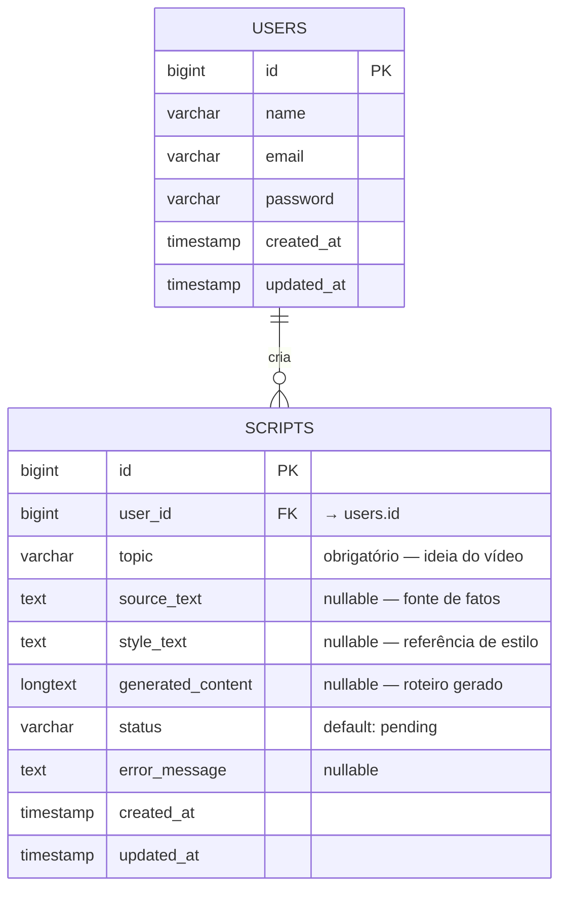
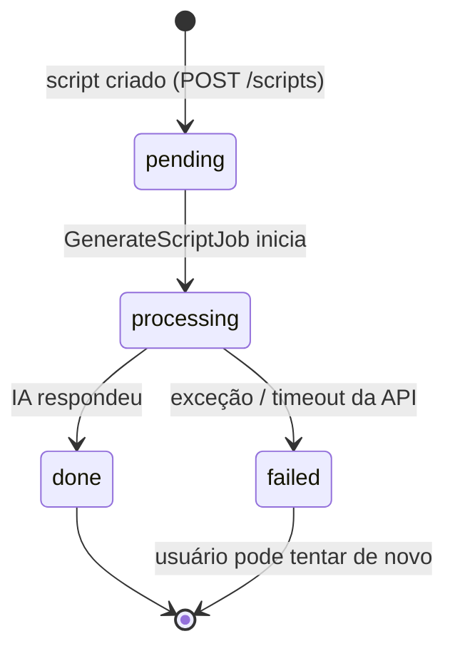
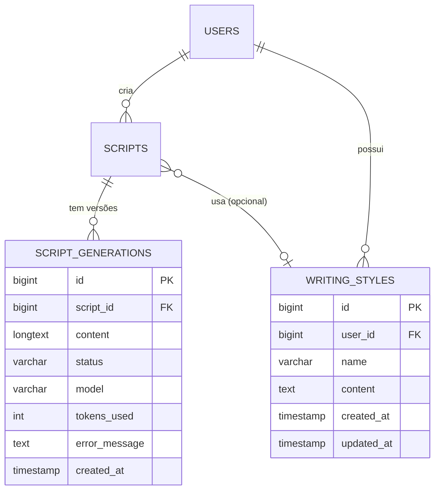

## Diagrama de banco de dados

```mermaid
erDiagram
    USERS ||--o{ SCRIPTS : "cria"

    USERS {
        bigint id PK
        varchar name
        varchar email
        varchar password
        timestamp created_at
        timestamp updated_at
    }

    SCRIPTS {
        bigint id PK
        bigint user_id FK "→ users.id"
        varchar topic "obrigatório — ideia do vídeo"
        text source_text "nullable — fonte de fatos"
        text style_text "nullable — referência de estilo"
        longtext generated_content "nullable — roteiro gerado"
        varchar status "default: pending"
        text error_message "nullable"
        timestamp created_at
        timestamp updated_at
    }
```

## Fluxo de status

```mermaid
stateDiagram-v2
    [*] --> pending : script criado (POST /scripts)
    pending --> processing : GenerateScriptJob inicia
    processing --> done : IA respondeu
    processing --> failed : exceção / timeout da API
    done --> [*]
    failed --> [*] : usuário pode tentar de novo
```

## Evolução v2 (referência futura, não criar ainda)

```mermaid
erDiagram
    USERS ||--o{ SCRIPTS : "cria"
    USERS ||--o{ WRITING_STYLES : "possui"
    SCRIPTS ||--o{ SCRIPT_GENERATIONS : "tem versões"
    SCRIPTS }o--o| WRITING_STYLES : "usa (opcional)"

    WRITING_STYLES {
        bigint id PK
        bigint user_id FK
        varchar name
        text content
        timestamp created_at
        timestamp updated_at
    }

    SCRIPT_GENERATIONS {
        bigint id PK
        bigint script_id FK
        longtext content
        varchar status
        varchar model
        int tokens_used
        text error_message
        timestamp created_at
    }
```